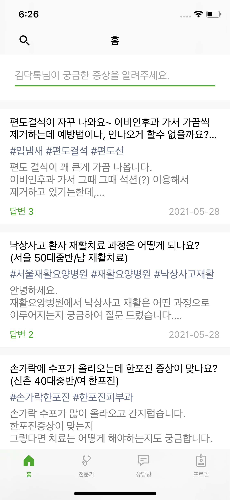
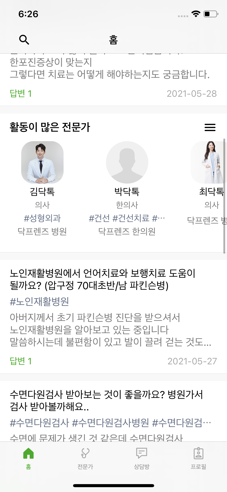
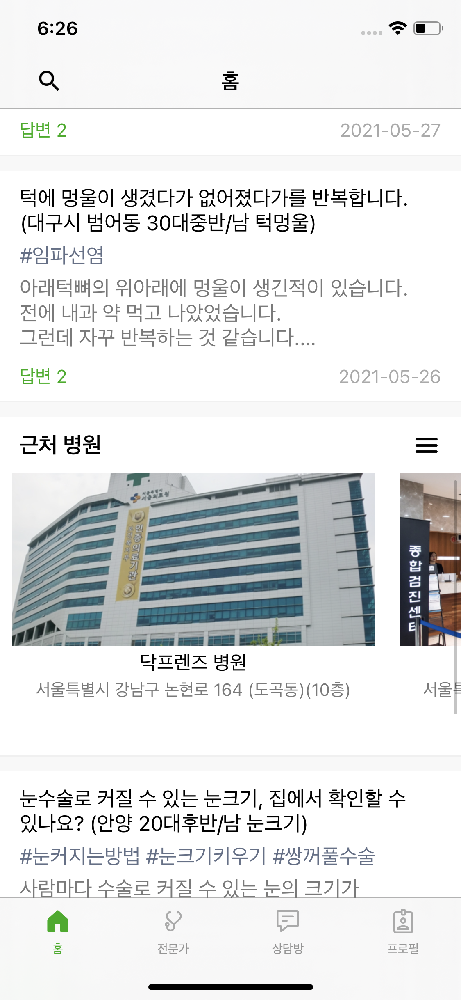

# Docfriends_iOS_Recruit

안녕하세요

닥프렌즈 iOS 개발자 채용에 지원해주셔서 감사합니다.

깃헙 [repository](https://github.com/Docfriends/Docfriends_iOS_Recruit)를 fork하신 뒤, 작업하여 폴더에 solution을 넣어 push 해주시면 됩니다.

이 프로젝트의 목적은 iOS를 활용해서 UI를 만드는 것 입니다.

전달되는 데이터의 형태를 확인하여 하단의 기능을 작동하는 UI를 만들어주시면 됩니다.

UI구조에 정확한 정답은 없으며, 해당 구조로 만든 이유를 설명할 수 있으면 됩니다.

# Guidelines

* 마감 기한은 과제 공유 메일이 도착한 일주일 후 입니다.
* Project는 빌드가 필수 전제이나, Project가 완벽하지 않아도 됩니다.
* Git을 반드시 사용해주세요.
* 개발 언어는 Swift를 사용해주세요.
* Deployment Target은 11.0 으로 해주세요.
* UI는 코드나 Storyboard를 사용하셔도 됩니다. (코드 추천)
* 특정 기능에 대한 라이브러리를 쓰셔도 무방합니다.
* 작업을 commit 단위로 나눠주세요
* 질문이 있으실 경우 info@docfriends.com으로 문의 부탁드립니다.

# Example

## 1. 홈

* 홈 탭만 구현하시면 됩니다.
* [홈 데이터(https://docfriends.github.io/Docfriends_iOS_Recruit/api/home.json)](https://docfriends.github.io/Docfriends_iOS_Recruit/api/home.json) 를 이용하여 화면을 표시 해주세요.
* 검색화면, 질문화면, 상담 상세화면, 전문가 상세화면, 병원 상세화면, 전문가 더보기화면, 병원 더보기화면은 영상처럼 navigationBar의 title만 변경하시면 됩니다.
* 아이콘은 resources 폴더의 Assets.xcassets을 사용하셔도 됩니다.
* Light Theme는 필수이지만 Drak Theme는 선택적으로 사용하셔도 됩니다.
* json데이터의 expertListPosition과 companyListPosition은 List의 index순서입니다.

* 상담 리스트가 나오는 화면입니다.

 

* 상담 리스트 사이에 전문가 리스트가 나오는 화면입니다.

 

* 상담 리스트 사이에 병원 리스트가 나오는 화면입니다.

<video controls autoplay width="300">
    <source src="example/sample.mp4" type="video/mp4"/>
</video>

* 전체 화면 샘플 영상입니다.

